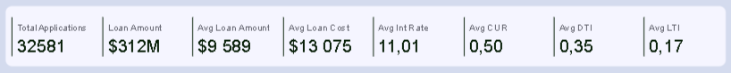
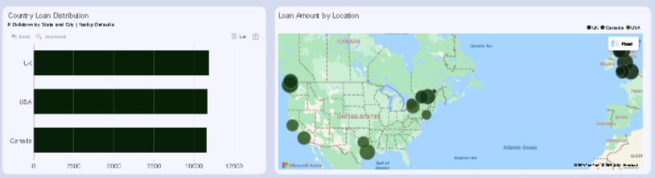
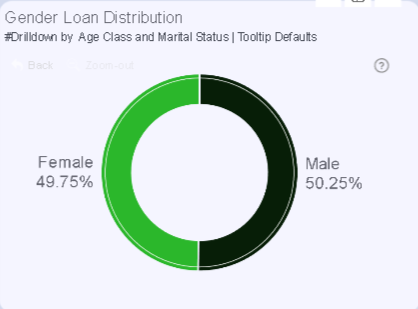
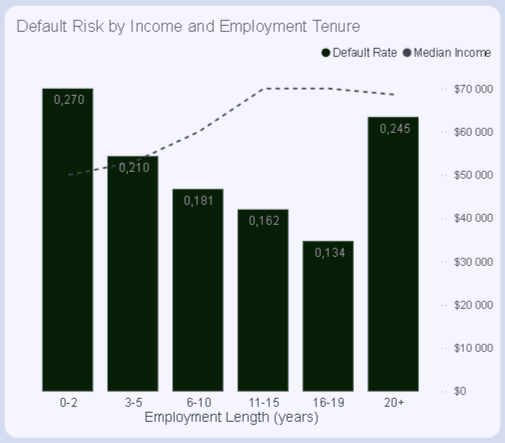
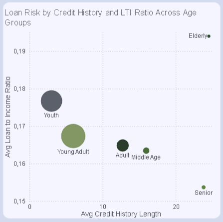
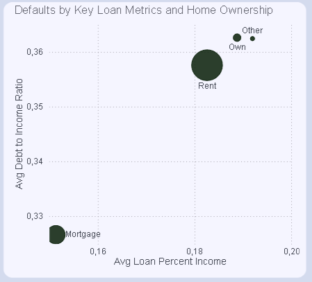
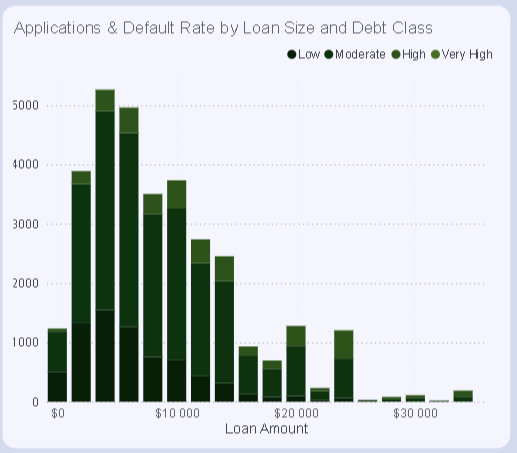
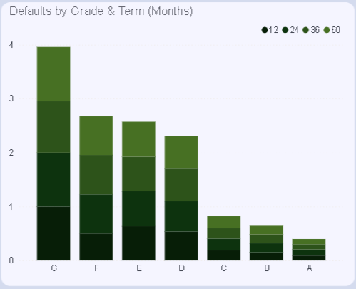
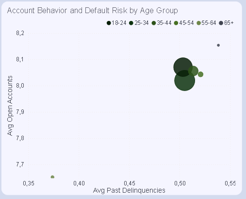
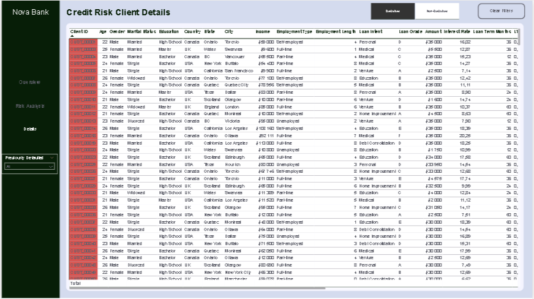

# Credit Risk Analytics for Smarter Lending Decisions

## Project Overview  
This project analyzes loan application data from Nova Bank to uncover patterns in borrower behavior and default risk across the USA, UK, and Canada. The goal is to support fair, data-driven lending policies that balance accessibility with financial protection.

As a credit risk analyst, I cleaned and prepared a dataset of over 32,000 loan applications using Python, addressing missing values, outliers, and feature engineering. The cleaned dataset was then exported to Excel and modeled in Power BI using a star-schema structure for dashboard development. This semantic model enables executive-level insights into borrower behavior, loan performance, and geographic risk segmentation.

The static Power BI dashboard can be found [here](nova_credit.pdf).

The Python data cleaning script is available [here](sept_credit_risk.ipynb).

The cleaned dataset used for analysis is available [here](credit_cleaned.xlsx).

## Business Objectives  
- Identify borrower groups more or less likely to default  
- Explore how loan size, income, interest rates, and repayment terms affect risk  
- Assess the impact of employment type, home ownership, and credit history  
- Compare risk patterns across countries (USA, UK, Canada)  
- Recommend policy adjustments to improve lending fairness and reduce exposure

## Nova Bank Key Metrics  
- **Default Risk Trends**: Tracking the proportion of loans that default across borrower segments, loan types, and time periods to identify high-risk patterns and early warning signals.  
- **Loan Portfolio Performance**: Analyzing loan amounts, interest rates, repayment terms, and total loan cost to assess profitability and exposure across different loan grades and purposes.  
- **Borrower Profile Insights**: Evaluating demographic and financial indicators—such as age, income, employment type, and home ownership—to understand which borrower groups are more likely to repay or default.  
- **Credit History Evaluation**: Measuring the impact of credit history length, past delinquencies, open accounts, and credit utilization on loan outcomes to refine risk scoring models.  
- **Geographic Risk Distribution**: Comparing default rates and borrower behavior across the USA, UK, and Canada to uncover regional lending risks and opportunities for policy adjustment.  
- **Affordability Ratios**: Monitoring loan-to-income and debt-to-income ratios to assess borrower repayment capacity and flag over-leveraged applicants.  
- **Loan Grade and Term Analysis**: Identifying which loan grades and repayment terms correlate with safer lending outcomes, helping Nova Bank optimize its product offerings.

## Database Schema

### Data Model Transformation

The analytical foundation of this report involves transforming the original flat-file dataset (`credit_cleaned.xlsx`) into a structured **star schema** optimized for analytical queries and Power BI reporting.

### Dataset Structure:
- **Fact Table**: `FactLoan` - Contains loan performance metrics and keys to all dimensions
- **Dimension Tables**:
  - `DimClient` - Borrower demographic information (age, income, employment)
  - `DimCreditHistory` - Credit background and financial history
  - `DimLoanDetails` - Loan-specific terms and conditions
  - `DimLocation` - Geographic data across USA, UK, and Canada

---

## Executive Summary

Nova Bank’s lending portfolio reflects strong demand and meaningful exposure. Over 30,000 applications have been processed, representing hundreds of millions in requested credit. Loan amounts typically exceed $9,000 per borrower, with repayment costs climbing higher due to interest. These figures stretch borrower affordability and amplify repayment pressure — especially among segments with elevated debt ratios and limited credit capacity.

Borrowers typically request loans worth 17% of their income, carry total debt equal to 35% of income, and use half of their available credit. While these ratios suggest moderate affordability overall, they also highlight pockets of financial strain that correlate with higher default risk.

Despite a majority of loans being repaid, 1 in 5 defaults — exposing Nova Bank to substantial financial risk. These defaults are not random: they cluster around specific borrower profiles, loan structures, and credit behaviors. 

---

## Key Findings

### 1. Loan Intent & Repayment Behavior  
Borrowers take loans for various reasons, but repayment behavior varies significantly by intent:

| Loan Purpose         | % of Defaults | % of Non-Defaults | Insight |
|----------------------|----------------|--------------------|---------|
| Medical              | 22.81%         | 17.47%             | Highest defaulted — medical loans carry the most risk. |
| Debt Consolidation   | 20.96%         | 14.61%             | Common reason for borrowing, but repayment is below average. |
| Education            | 15.63%         | 20.97%             | Strong repayment — education borrowers are more reliable. |
| Personal             | 15.45%         | 17.36%             | Mid-range risk, slightly better than average. |
| Venture              | 11.92%         | 19.13%             | High repayment — venture loans show strong performance. |
| Home Improvement     | 13.24%         | 10.46%             | Lower volume, moderate risk. |

**Takeaway**: Education and venture loans are the most promising segments. Medical and debt consolidation loans require tighter controls.

---

### 2. Regional Risk Distribution  

Nova Bank’s lending activity is evenly distributed across its three core markets, with each region contributing roughly one-third of total applications and loan volume. However, subtle differences in application density and risk concentration reveal important strategic considerations:

- **UK**: Leads slightly in application volume with **10,944 loans** totaling **$104.78M**. Scotland and Manchester show elevated default risk, suggesting regional affordability pressures despite strong demand.  
- **USA**: Close behind with **10,852 applications** and **$103.67M** in loan volume. California and Texas account for the highest number of defaults, indicating concentrated risk in high-demand states.  
- **Canada**: Slightly lower volume at **10,785 applications**, but with the **highest average loan size** ($9,641). Vancouver stands out with the most pronounced default rate, pointing to urban affordability strain.

Each region reports a **22% default rate**, but the consistency masks localized risk clusters. Urban centers — particularly in the UK’s north, the US south and west, and Canada’s west coast — show disproportionate exposure.

**Strategic Insight**: While national-level risk appears uniform, application density and default clustering suggest the need for **regionally adaptive lending policies**. Tailoring credit thresholds and affordability checks to urban conditions could reduce exposure without constraining growth in high-demand areas.

---

### 3. Borrower Demographics  

**Gender**

Male applicants: 16,290 applications, 3,586 defaults → 22.0% default rate

Female applicants: 16,561 applications, 3,522 defaults → 21.3% default rate

Default rates are statistically similar across genders, suggesting no need for gender-based policy differentiation.

**Age Group**

18–35 years: 18,942 applications, 4,228 defaults → 22.3% default rate

36–55 years: 10,214 applications, 2,212 defaults → 21.7% default rate

56+ years: 3,695 applications, 668 defaults → 18.1% default rate 

Younger borrowers dominate both applications and defaults. Older borrowers show lower risk, indicating stronger repayment behavior and potentially more stable financial profiles.

**Marital Status**

Single: 19,842 applications, 4,612 defaults → 23.2% default rate

Married: 13,009 applications, 2,496 defaults → 19.2% default rate 

Single borrowers carry higher default risk, suggesting that marital status may be a useful proxy for financial stability in credit scoring models.

---

### 4. Employment Tenure & Income  

- Default risk drops as employment length increases — from 27% for those with less than 2 years to 13.4% for those with 16–19 years.  
- Median income rises steadily with tenure, peaking at $70,000 for borrowers with 11–19 years of experience.  
- Borrowers with 20+ years of experience show a higher default rate (24.5%) despite earning nearly as much.

---

### 5. Credit History & Loan-to-Income Ratio  

- Youth (18–25): Shortest credit history (2.99 years), highest LTI ratio (0.18), highest default volume.  
- Older borrowers (46+): Longest credit history (16–24 years), lowest LTI ratios (0.15–0.16), lowest defaults.

---

### 6. Home Ownership & Affordability  

- Renters: Highest default count (5,192), highest loan-to-income and debt-to-income ratios.  
- Mortgage holders: Lower ratios and fewer defaults.  
- Homeowners (own outright): Small group, lowest default rates.

---

### 7. Loan Amount & Debt Class Insights

Most loans fall between **$0–$16,000**, with a spike around **$4,000**, where application volume is highest. Very few loans exceed **$26,000**, and those show **much higher default rates**, especially among borrowers with moderate debt levels.

Interestingly, borrowers with **low or moderate other debt** sometimes default more than those with high debt — suggesting that traditional debt class labels don’t always reflect true repayment risk.

 
- Mid-range loans drive volume and portfolio exposure  
- High-value loans carry volatility and concentrated risk  
- Debt class alone isn’t a reliable predictor — risk depends on how debt interacts with loan size

---

### 8. Loan Grade & Term  

- Grade A loans are the safest across all terms — default rates stay around 10%.  
- Grades B and C show moderate risk (15–22%).  
- Grades D to G are high-risk: Grade D defaults reach 60%+, Grade G defaults hit 100%.  
- Shorter terms (12–36 months) tend to have slightly lower default rates, especially in riskier grades.

---

### 9. Account Behavior  

- Younger age groups (18–34) have the most defaults and slightly fewer open accounts.  
- Delinquency rates are similar across all age groups (~0.50), except for ages 55–64 (0.37).  
- Older borrowers (55+) have fewer defaults and slightly more open accounts.

---

### 10. Dashboard Enhancements  
- Customer Details Table includes a default status flag with conditional formatting and slicer-based filtering.  
- Defaulted customers are highlighted in red; non-defaulted in green.  
- Other slicer: check if client previously defaulted.

---

## Recommendations

### Portfolio Health & Loan Intent  
- Prioritize education and venture loans with stronger repayment behavior.  
- Reassess medical and debt consolidation loans; consider collateral, co-signers, or financial counseling.  
- Integrate loan intent into risk scoring models to adjust approval thresholds and interest rates.

### Borrower Profile Strategy  
- Target mid-tenure, married borrowers aged 35–54 with tailored marketing and product bundles.  
- Apply tighter checks for youth and young adults, especially single renters with short credit histories.  
- Avoid gender-based assumptions in scoring models.

### Employment & Income  
- Favor borrowers with 6–19 years of employment; consider pre-approval campaigns.  
- Flag early-career and late-career applicants for manual review.  
- Assess retirement risk and income stability for 20+ year tenure applicants.

### Home Ownership & Affordability  
- Introduce stricter affordability checks for renters: minimum income thresholds, lower loan-to-income caps, budgeting tools.  
- Offer refinancing options and loyalty incentives for mortgage holders and homeowners.  
- Use LTI and DTI ratios as gating criteria for approval.

### Loan Structure  
- Promote Grade A–C loans with longer terms and better rates.  
- Cap term lengths at 36 months for Grades D–G; require stronger credit behavior or collateral for longer terms.  
- Introduce dynamic term recommendations based on borrower profile and grade.

### Account Behavior  
- Use open account volume and delinquency history to refine risk scoring.  
- Flag applicants with frequent delinquencies regardless of account volume.  
- Offer credit-building products with lower exposure and educational support for younger applicants.

### Dashboard Enhancements  
- Maintain the Customer Details Table with slicer-based filtering and conditional formatting.  
- Add export functionality and calculated risk scores for audit and analyst teams.  
- Integrate drill-through views to explore full credit history and repayment behavior per client.

---

## Conclusion  
Nova Bank’s credit risk landscape reveals clear patterns in borrower behavior, loan structure, and repayment outcomes. By aligning lending policies with these insights—especially around borrower age, employment tenure, loan intent, and housing status.

[Unamended Power BI report weblink here](https://app.powerbi.com/view?r=eyJrIjoiZWIyMTVjOWYtYjNhNC00M2YxLWJhYzYtZTk3YWE4OWZhZDAzIiwidCI6IjQ2NTRiNmYxLTBlNDctNDU3OS1hOGExLTAyZmU5ZDk0M2M3YiIsImMiOjl9)

