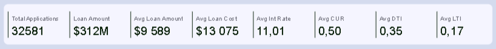
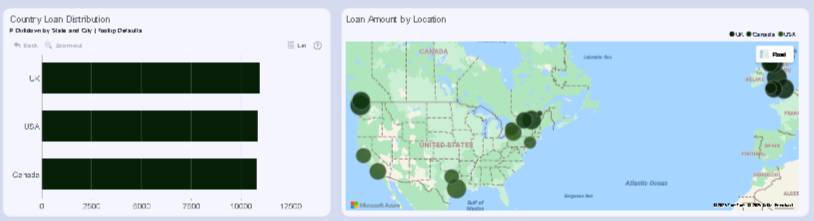
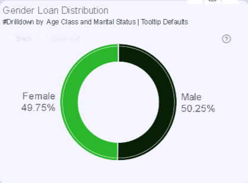
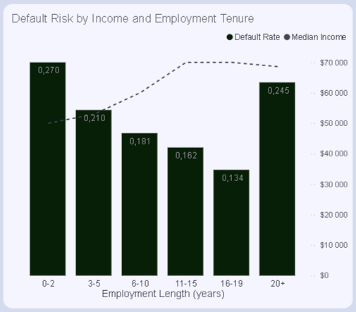
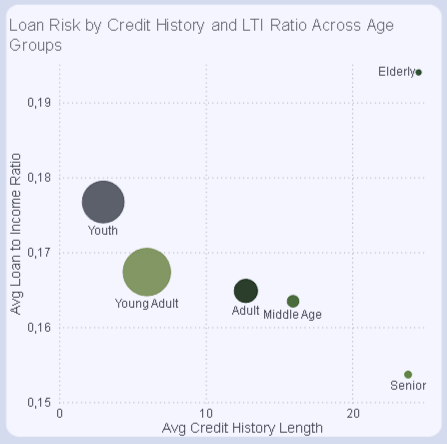
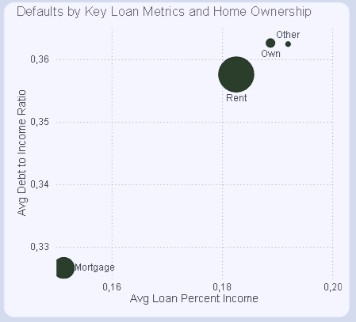
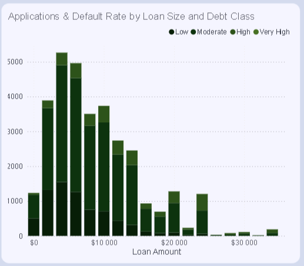
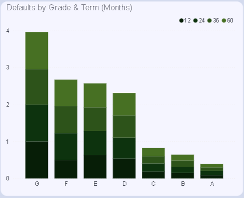
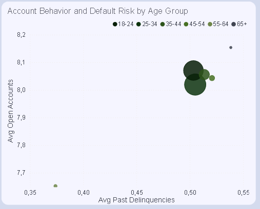
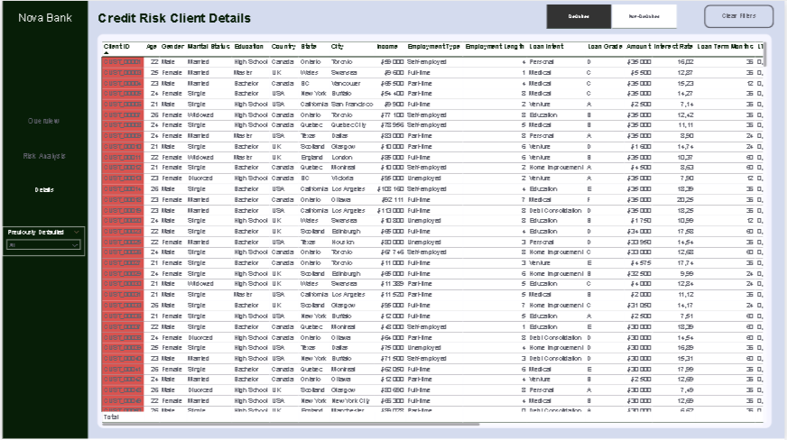

# Credit Risk Analytics for Smarter Lending Decisions


[](https://app.powerbi.com/view?r=eyJrIjoiZWIyMTVjOWYtYjNhNC00M2YxLWJhYzYtZTk3YWE4OWZhZDAzIiwidCI6IjQ2NTRiNmYxLTBlNDctNDU3OS1hOGExLTAyZmU5ZDk0M2M3YiIsImMiOjl9)

---

## Overview

This project analyses loan application data from Nova Bank to uncover patterns in borrower behaviour and default risk across the USA, UK, and Canada. The goal is to support fair, data-driven lending policies that balance accessibility with financial protection.

The pipeline runs from raw data through Python cleaning and feature engineering, into a structured star schema in Excel, and finally into an interactive Power BI dashboard designed for executive and analyst audiences alike.

**Source:** [DataDNA September Challenge](https://datadna.onyxdata.co.uk/challenges/september-2025-datadna-credit-risk-analytics-challenge/) — a monthly real-world data analytics challenge.

---

## Repository Structure
```
Credit-Risk-Report/
│
├── data/
│   ├── credit_risk.xlsx            # Raw dataset — 32,581 loan applications (29 columns)
│   └── credit_cleaned.xlsx         # Cleaned dataset — star schema ready for Power BI (35 columns)
│
├── dashboard/
│   ├── nova_credit.pbix            # Interactive Power BI report file
│   └── nova_credit.pdf             # Static Power BI dashboard export
│
├── notebook/
│   └── sept_credit_risk.ipynb      # Python data cleaning & EDA notebook (Google Colab)
│
├── presentation/
│   └── presentation.pdf            # Executive presentation — quick insights
│
├── images/
│   ├── Credit Risk ERD.png         # Star schema entity relationship diagram
│   ├── nova_kpis.png               # KPI overview screenshot
│   ├── location.png                # Geographic risk distribution
│   ├── gender.png                  # Borrower demographics
│   ├── tenure.png                  # Employment tenure analysis
│   ├── history.png                 # Credit history & LTI ratios
│   ├── home.png                    # Home ownership & affordability
│   ├── loan_dist.png               # Loan amount distribution
│   ├── grade.png                   # Loan grade & term analysis
│   ├── account.png                 # Account behaviour
│   └── table.png                   # Customer details table
│
└── README.md
```

> **Data:** The raw dataset (`credit_risk.xlsx`) is provided for reproducibility. Download and place in the `data/` folder before running the notebook.

---

## Problem Statement

Nova Bank faces a fundamental tension at the heart of its lending business: approve too many high-risk loans and the bank absorbs significant financial losses — approve too few and it alienates creditworthy customers while failing its mission of fair, accessible lending.

With a **21.8% default rate** across 32,581 loan applications, 1 in 5 borrowers is failing to repay. These defaults are not randomly distributed — they cluster around specific borrower profiles, loan structures, and geographic patterns that standard approval processes are not currently capturing effectively.

The core challenge is building a data-driven understanding of *who* defaults, *why* they default, and *which lending policy levers* can reduce exposure without restricting access to credit for borrowers who would repay.

---
## Business Objectives

- Identify borrower groups more or less likely to default
- Explore how loan size, income, interest rates, and repayment terms affect risk
- Assess the impact of employment type, home ownership, and credit history
- Compare risk patterns across countries (USA, UK, Canada)
- Recommend policy adjustments to improve lending fairness and reduce exposure

---

## Dataset

**Source:** DataDNA September Challenge — synthetic loan application dataset modelled on real-world lending data.

| File | Rows | Columns | Description |
|---|---|---|---|
| `credit_risk.xlsx` | 32,581 | 29 | Raw loan application data |
| `credit_cleaned.xlsx` | 32,581 | 32 | Cleaned and feature-engineered output |

---

## Python — Data Cleaning & Feature Engineering

The raw dataset contained two columns with missing values and several data quality issues that required treatment before modelling could begin.

**Missing values identified and resolved:**

| Column | Missing % | Treatment |
|---|---|---|
| `loan_int_rate` | 9.56% | Median imputation by loan grade |
| `person_emp_length` | 2.75% | Median imputation (median = 4.0 years) |

**Outlier treatment:**

- `person_emp_length` — 5 records contained employment lengths above 60 years (biologically implausible for the age distribution). These were set to NaN and subsequently imputed.
- `person_age` — 5 records contained ages above 100 years. These were identified and replaced with the dataset median of 26 years.

**Feature engineering — 3 new columns added:**

- `age_group` — binned age into 6 groups (18–24, 25–34, 35–44, 45–54, 55–64, 65+) using `pd.cut()`
- `age_class` — labelled groups as Youth, Young Adult, Adult, Middle Age, Senior, Elderly for readability in Power BI
- `total_loan_cost` — engineered as `loan_amnt × (1 + (loan_int_rate/100) × (loan_term_months/12))` to capture the full repayment burden including interest

**EDA — correlation analysis:**

A full correlation matrix identified three highly correlated feature pairs worth noting for model development:

- `loan_percent_income` and `loan_to_income_ratio` — 0.999 correlation (near-duplicate metrics)
- `loan_amnt` and `total_loan_cost` — 0.970 correlation (expected — cost is derived from amount)
- `person_income` and `other_debt` — 0.887 correlation (higher earners carry more absolute debt)

Final cleaned dataset: **32,581 rows × 32 columns**, exported to `credit_cleaned.xlsx` for Power BI modelling.

---

## Database Schema

### Star Schema — Power BI Data Model

The cleaned flat file was restructured into a star schema to enable efficient analytical queries and clean Power BI relationships.


| Table | Type | Description |
|---|---|---|
| `FactLoan` | Fact | Loan performance metrics and foreign keys to all dimensions |
| `DimClient` | Dimension | Borrower demographics — age, income, employment |
| `DimCreditHistory` | Dimension | Credit background and financial history |
| `DimLoanDetails` | Dimension | Loan-specific terms, grade, and conditions |
| `DimLocation` | Dimension | Geographic data across USA, UK, and Canada |

---

## Executive Summary



Nova Bank processed **32,851 loan applications** totalling **$312 million** in requested credit. The average loan was **$9,589** at an average interest rate of **11%**. Borrowers typically requested loans worth 17% of their annual income, carry total debt equal to 35% of income, and use approximately half of their available credit.

While **78% of loans were repaid**, **1 in 5 defaulted** — a meaningful exposure that clusters around specific borrower profiles, loan structures, and credit behaviours rather than being randomly distributed across the portfolio.

---

## Key Findings

### 1. Loan Intent & Repayment Behaviour

| Loan Purpose | % of Defaults | % of Non-Defaults | Risk Level |
|---|---|---|---|
| Medical | 22.81% | 17.47% | 🔴 Highest risk |
| Debt Consolidation | 20.96% | 14.61% | 🔴 Above average |
| Personal | 15.45% | 17.36% | 🟡 Moderate |
| Home Improvement | 13.24% | 10.46% | 🟡 Moderate |
| Education | 15.63% | 20.97% | 🟢 Lower risk |
| Venture | 11.92% | 19.13% | 🟢 Lowest risk |

> **Takeaway:** Education and venture loans are the most promising segments. Medical and debt consolidation loans require tighter controls or collateral requirements.

---

### 2. Regional Risk Distribution



Each of the three markets contributes roughly one-third of total applications, with near-identical 22% default rates at the national level. However, localised risk clusters emerge within each region:

- **UK** — 10,944 loans · $104.78M · Scotland and Manchester show elevated risk
- **USA** — 10,852 loans · $103.67M · California and Texas account for highest defaults
- **Canada** — 10,785 loans · $95.4M · Vancouver shows the most pronounced default rate

> **Strategic Insight:** National-level uniformity masks urban concentration risk. Regionally adaptive lending policies — particularly for urban centres — could reduce exposure without constraining growth.

---

### 3. Borrower Demographics



**Gender** — default rates are statistically similar (Male: 22.0%, Female: 21.3%). Gender should not be a policy differentiator.

**Age Group:**

| Age Group | Applications | Defaults | Default Rate |
|---|---|---|---|
| 18–35 | 18,942 | 4,228 | 22.3% |
| 36–55 | 10,214 | 2,212 | 21.7% |
| 56+ | 3,695 | 668 | 18.1% |

**Marital Status** — Single borrowers carry a 23.2% default rate vs 19.2% for married borrowers — a 4 percentage point gap worth incorporating into risk scoring.

---

### 4. Employment Tenure & Income



Default risk drops consistently as employment length increases — from **27% for borrowers with under 2 years** of experience to **13.4% for those with 16–19 years**. Median income peaks at $70,000 for the 11–19 year tenure group.

One notable exception: borrowers with **20+ years of tenure show a higher default rate (24.5%)** despite strong incomes — likely driven by retirement transition risk and reduced income stability.

---

### 5. Credit History & Loan-to-Income Ratio



- Youth (18–25): Shortest credit history (2.99 years), highest LTI ratio (0.18), highest default volume
- Older borrowers (46+): Longest credit history (16–24 years), lowest LTI ratios (0.15–0.16), fewest defaults

---

### 6. Home Ownership & Affordability



| Ownership Type | Default Count | Risk Profile |
|---|---|---|
| Renter | 5,192 | 🔴 Highest — elevated LTI and DTI |
| Mortgage | Lower | 🟡 Moderate |
| Outright Owner | Lowest | 🟢 Most stable |

---

### 7. Loan Amount Distribution



Most loans fall between **$0–$16,000** with the highest application volume around **$4,000**. Loans exceeding **$26,000** show significantly higher default rates. Notably, borrowers with low or moderate other debt sometimes default at higher rates than those with high debt — suggesting that debt class alone is not a reliable predictor and should be assessed in combination with loan size and income.

---

### 8. Loan Grade & Term



| Grade | Risk Level | Default Rate |
|---|---|---|
| A | 🟢 Safest | ~10% across all terms |
| B–C | 🟡 Moderate | 15–22% |
| D | 🔴 High risk | 60%+ |
| E–G | 🔴 Very high | Up to 100% |

Shorter terms (12–36 months) consistently outperform longer terms for grades D and below.

---

### 9. Account Behaviour



Delinquency rates are consistent across most age groups (~0.50), with the exception of borrowers aged 55–64 (0.37). Younger borrowers generate higher absolute default numbers due to application volume, not significantly higher per-borrower risk rates.

---

### 10. Dashboard Features



- Customer Details Table with conditional formatting — defaulted clients highlighted in red, non-defaulted in green
- Slicer-based filtering by default status, region, loan grade, and borrower profile
- Drill-through views for individual client credit history and repayment behaviour

---

## Recommendations

**Portfolio & Loan Intent**
- Prioritise education and venture loans — stronger repayment behaviour
- Apply tighter controls on medical and debt consolidation — collateral, co-signers, or financial counselling
- Integrate loan intent as a variable in risk scoring models

**Borrower Profile**
- Target mid-tenure, married borrowers aged 35–54 with tailored products
- Apply stricter affordability checks for single renters aged 18–35 with short credit histories
- No gender-based assumptions in scoring — rates are statistically equivalent

**Employment & Income**
- Favour borrowers with 6–19 years of tenure for pre-approval campaigns
- Flag early-career (<2 years) and late-career (20+ years) applicants for manual review
- Assess retirement income stability separately for 20+ year tenure borrowers

**Loan Structure**
- Promote Grade A–C loans with longer terms
- Cap Grade D–G loans at 36 months maximum
- Use LTI and DTI ratios as hard gating criteria for approval — not advisory metrics

**Account Behaviour**
- Weight delinquency history in risk scoring regardless of age group
- Offer credit-building products with lower exposure limits for younger applicants

---

## Limitations

- Dataset is synthetic — patterns may not perfectly reflect real-world lending distributions
- No time dimension in the data — default rates cannot be tracked as a trend over time
- Counterfactual analysis is not possible — we cannot know how borrowers would have performed under different loan structures

---

## How to Run

1. Open `sept_credit_risk.ipynb` in Google Colab or Jupyter
2. Upload `credit_risk.xlsx` as the raw input
3. Run all cells — the cleaned file `credit_cleaned.xlsx` is produced as output
4. Import `credit_cleaned.xlsx` into Power BI and apply the star schema relationships
5. View the live interactive dashboard via the badge at the top of this README

---

## Dependencies

```
pandas
numpy
matplotlib
seaborn
openpyxl
```

---

## Context

This project was built as part of the **DataDNA September Challenge** — a monthly community-driven analytics challenge designed to develop real-world data skills through practical, business-grounded datasets.

---

*Dataset provided by DataDNA for educational and portfolio purposes. All analysis is original work.*
